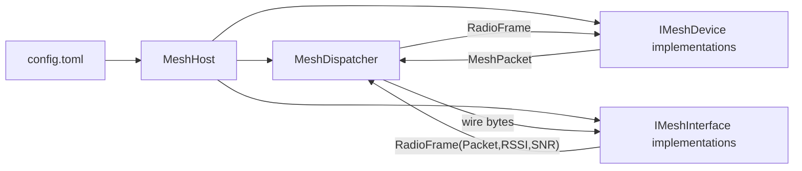

# MeshCore .NET Internals

This document is the maintainer handoff for the .NET port. It explains how the project is arranged, which code owns each protocol concern, and which compatibility boundaries still rely on the Python implementation as an oracle.

## Current Parity Status

The .NET host is intended to replace the Python host, but the Python sources should remain until fixture and hardware parity are proven. The C# implementation currently covers the main runtime shape: packet encoding/decoding, MeshCore crypto and Ed25519 behavior, identity/contact/channel persistence, dispatcher queueing, BasicMesh-derived devices, companion app protocol handling, and Linux transport backends for serial/TCP companion links and SX126x LoRa.

The remaining proof work is not ordinary feature development. It is compatibility verification: generate golden fixtures from Python, run those fixtures against .NET, run hardware smoke checks, fix any differences, and only then delete Python.

## Project Shape

- `Program.cs` loads TOML and starts `MeshHost`.
- `MeshCoreHost.cs` adapts the Python TOML layout into .NET interfaces, devices, identities, channels, and access settings.
- `Core/Packet.cs` is the raw MeshCore v1 packet envelope: header, route, type, path, payload, and wire validation.
- `Core/TypedPackets.cs` contains typed packet parsers/builders layered over `MeshPacket`.
- `Core/MeshCrypto.cs`, `Core/MeshEd25519.cs`, `Core/MeshIdentity.cs`, and `Core/GroupChannel.cs` implement protocol primitives and persistence.
- `Core/Dispatcher.cs` is the runtime packet pump between devices and interfaces.
- `Core/BasicMeshDevice.cs` plus `Core/CliRoomRepeaterDevices.cs` and `Core/CompanionRadioDevice.cs` implement device behavior.
- `Core/Interfaces.cs`, `Core/CompanionLinks.cs`, `Core/CompanionRadioInterface.cs`, and `Core/LoRaInterface.cs` implement transport boundaries.
- `meshcore-net.Tests/` contains compatibility and regression tests. These are unit-level tests; hardware tests are still manual.

## Runtime Flow



`RadioFrame` is the receive-side data unit. It carries raw packet bytes plus radio metadata. `MeshPacket` is the protocol envelope after parsing. Typed packet classes decode the payload only when device behavior needs protocol semantics.

## Packet Layers

`MeshPacket` owns only the common frame shape:

- version bits in the header
- route bits: direct, flood, zero-hop
- type bits: advert, text, req, response, path, ack, group, anon req, trace
- path bytes
- payload bytes

`TypedPackets.cs` is where payload semantics live. Incoming encrypted direct packets are parsed through `MeshSrcDestPacket`, which locates a destination by hash, uses the destination shared secret, checks the HMAC, then decrypts. Outgoing encrypted packets derive the same shared secret from the sender identity and destination identity.

Path packets may contain extra ACK or RESPONSE payloads. This mirrors Python behavior where a path reply can avoid sending a separate response frame.

## Crypto And Identity

`MeshCrypto` preserves the Python AES-ECB plus HMAC-SHA256 behavior. It intentionally does not switch to a modern AEAD because compatibility with existing MeshCore wire frames is the goal.

`MeshEd25519PrivateKey` accepts either:

- a 32-byte seed, which is hashed to the MeshCore private-key representation
- a 64-byte MeshCore private key, which is used directly

The Ed25519 implementation is kept in-tree so MeshCore key derivation and shared-secret behavior can match Python exactly. Do not replace it with a library unless fixture tests prove identical public keys, signatures, verification, and shared secrets.

`AdvertData` parses and validates signed adverts. `SelfIdentity` generates this node's advert. `IdentityStore` keeps contacts in memory, and `FileIdentityStore` persists `contacts.mesh` in the Python-compatible line format.

## Channels

`Channel` is a 16-byte group key plus a 32-byte padded name. Channel messages use the channel key hash to select the channel and `MeshCrypto` for encrypt/decrypt. `ChannelStore` loads and writes `channels.json`; by default it adds the public channel key, matching the Python behavior.

## Dispatcher

`MeshDispatcher` is the shared runtime pump. It owns:

- registered interfaces and devices
- outbound priority queue ordering
- per-packet timeout discard
- duplicate suppression with expiry
- receive loops for each interface
- optional internal zero-hop forwarding between devices
- airtime accounting based on interface transmit return values

Cancellation matters here. `StopAsync` cancels the linked token that the dispatch and receive loops observe; this is what prevents the explicit xUnit run from hanging during shutdown.

## Devices

`BasicMeshDevice` is the shared receive pipeline. It parses `RadioFrame` into a typed incoming packet, updates stats, handles generic behavior such as adverts and ACK/path responses, and dispatches to virtual `Rx*Async` hooks.

`CliMeshDevice` adds anonymous login, CLI text handling, and status responses. `RoomMeshDevice` adds writer/read-only room posting behavior. `RepeaterMeshDevice` forwards trace packets and marks itself as a repeater.

`CompanionRadioDevice` is the companion app-facing device. It keeps app-side message queues in memory, pushes raw/adverts/message waiting/status events to the app link, and handles the same practical command surface as the Python companion radio. App-side config changes remain non-persistent unless the underlying Python behavior persisted them.

## Companion App Links

Companion app framing is marker plus little-endian length plus payload:

- app-to-radio frames start with `<`
- radio-to-app frames start with `>`

`TcpCompanionAppLink` listens for one TCP app client. `SerialCompanionAppLink` uses `System.IO.Ports` with the same frame codec. `CompanionRadioMeshInterface` is the opposite direction: it treats a serial companion radio as an `IMeshInterface` and bridges mesh frames through `SerialCompanionRadioFrameLink`.

## Hardware Interfaces

`LinuxLoRaInterface` wraps an `ISx126xRadio`. The production implementation, `ManagedSx126xRadio`, talks to an SX126x device through .NET IoT SPI/GPIO APIs and configures the Python default LoRa parameters. The fake-radio seam exists so dispatcher and interface behavior can be tested without hardware.

## Configuration

`MeshHost` uses simple helpers to read the existing TOML shape. Important defaults:

- `interfaces` defaults to `["mock"]` if omitted
- LoRa defaults match the Python example config
- companion app defaults to WiFi/TCP unless `interface = "serial"` is configured on the device
- private keys are generated if no `privatekey` is provided

The duplicate `MeshCore.NetCore10/` project is not the canonical host. Treat `meshcore-net/` as the target unless cleanup later removes or merges the duplicate project.

## Persistence Boundaries

Persisted:

- contacts via `contacts.mesh`
- channels via `channels.json`

Not persisted by design, matching the Python behavior:

- app-side config changes not already written by the Python implementation
- queued companion app messages
- fake battery/sensor readings
- telemetry state beyond current command responses

## Tests And Verification

Useful local commands:

```bash
cd meshcore-net
dotnet build
dotnet test meshcore-net.Tests/meshcore-net.Tests.csproj --verbosity minimal
```

Before deleting Python:

1. Generate checked-in golden fixtures from Python.
2. Add .NET tests for those fixtures.
3. Run hardware smoke checks for mock, WiFi companion, serial companion, and LoRa.
4. Fix any deltas.
5. Remove Python only after fixture and hardware parity are both green.
